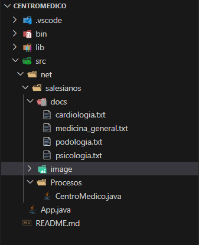
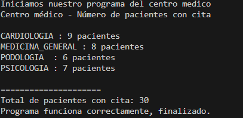

# Centro Médico (Gestion de pacientes por especialidad) 

# Descripcion sobre mi proyecto
Mi aplicacion se basa en un centro medico el cual lleva el contro de los pacientes segun las especilidades la cual tiene el centro medico

El programa lo que hacer es lee ficheros de texto = .txt, cada uno por especialidad los cuales son: cardiología, psicología, podología y medicina general, y lo que muestra este es el numero de pacientes que tienen cita en esta especialidades. El codigo del programa se encuentra en una clase llamada
----CentroMedico.java----

# Necesidad de la empresa
Un centro medico necesita saber cuantos pacientes tienen asginados para cada especialidad y asi organizar a los medicos y especialistas para su disponibilidad.

Con esta aplicacion el centro medico ahorra tiempo y evitar errores.

# Funcionamiento de mi programa
Mi programa creer una estrucutra muy comoda para poder trabaja en ella, docs es todo estan todos los ficheros, CentroMedico.java es donde esta todo el codigo y App.java es donde se ejecuta la aplicacion.

# Manual de usuario
Hay dos manera de ejecuta el programa:

1.- Utilizando la ventana de comando usamos
java net.salesianos.Procesos.App
Aqui lo que hace es ejecutar el programa directamente.

2.- La segunda salida es entrando a la clase App.java, y ejecuta directamente desde ahi, el resultado seria el mismo.

👨‍💻 Autor
Gabriel David Gelviz Monterrey
